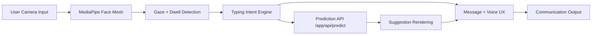

# GAZE

<p align="center">
  <strong>Assistive communication infrastructure powered by camera-based eye tracking.</strong><br />
  <em>Restoring communication access without expensive dedicated hardware.</em>
</p>

<p align="center">
  <a href="https://nextjs.org/"></a>
  <a href="https://react.dev/"></a>
  <a href="https://www.typescriptlang.org/"></a>
  <a href="https://tailwindcss.com/"></a>
  <a href="./LICENSE"></a>
</p>

---

## Overview

GAZE is a Next.js platform for accessible communication. It combines browser-based gaze interaction, predictive text workflows, and a production-oriented web app architecture to support people who cannot rely on speech or motor input.

### Why GAZE

| Problem | GAZE Approach |
| --- | --- |
| AAC hardware can be costly and hard to scale | Use commodity cameras and modern web tech |
| Communication workflows are fragmented across tools | Provide unified typing, prediction, and UX flows |
| Accessibility is often an afterthought | Treat accessibility, privacy, and performance as core constraints |

## Product Surfaces

| Route | Purpose | Highlights |
| --- | --- | --- |
| `/` | Product homepage | Problem framing, value proposition, and deployment narrative |
| `/demo` | Interactive experience | Gaze simulation, calibration, dwell detection, predictive keyboard |
| `/governance` | Ethics and safety | Privacy architecture, safety modes, accountability framing |
| `/institutions` | Enterprise and healthcare context | Compliance, rollout planning, institutional workflow fit |
| `/pitch` | Decision support deck | Structured presentation for stakeholders and funding conversations |

## System Architecture



## Stack

| Layer | Technologies |
| --- | --- |
| App framework | Next.js 16, React 19, TypeScript |
| Styling and motion | Tailwind CSS 4, Framer Motion |
| CV and inference | MediaPipe Face Mesh, ONNX Runtime Web |
| State and data flow | Zustand, SWR |
| Reliability and ops | Sentry, Jest, Lighthouse |

## Quick Start

### Prerequisites

- Node.js 18+
- npm 9+
- A modern browser with camera permissions

### Local Development

```bash
git clone <your-fork-url>
cd Gaze
npm install
npm run dev
```

Open `http://localhost:3000`.

### Production Build

```bash
npm run build
npm run start
```

## Scripts

| Command | Description |
| --- | --- |
| `npm run dev` | Start development server with webpack |
| `npm run dev:turbo` | Start development server with Turbopack |
| `npm run build` | Create production build |
| `npm run start` | Run production server |
| `npm run lint` | Run ESLint |
| `npm run type-check` | Run TypeScript checks |
| `npm test` | Run Jest tests |
| `npm run test:watch` | Run tests in watch mode |
| `npm run test:coverage` | Generate coverage report |
| `npm run performance` | Run Lighthouse audit against localhost |
| `npm run analyze` | Build with bundle analysis |

## Repository Layout

```text
src/
  app/
    api/predict/          # Prediction endpoint
    demo/                 # Interactive demo flows
    governance/           # Governance and ethics pages
    institutions/         # Institution-facing pages
    pitch/                # Pitch deck experience
  components/
    governance/           # Governance-specific UI
    institutions/         # Institutional UI
    pitch/                # Pitch-specific UI
  lib/                    # Shared logic, stores, helpers
public/                   # Static assets
```

## Engineering Principles

- Accessibility first: build keyboard and assistive-tech-friendly interfaces.
- Privacy by design: minimize and isolate sensitive processing.
- Real-time UX: keep feedback loops low latency.
- Progressive reliability: test, monitor, and fail safely.

## Contributing

Contributions are welcome. Start with the contributor guide: [CONTRIBUTING.md](./CONTRIBUTING.md)

## License

This project is licensed under the MIT License. See [LICENSE](./LICENSE).
